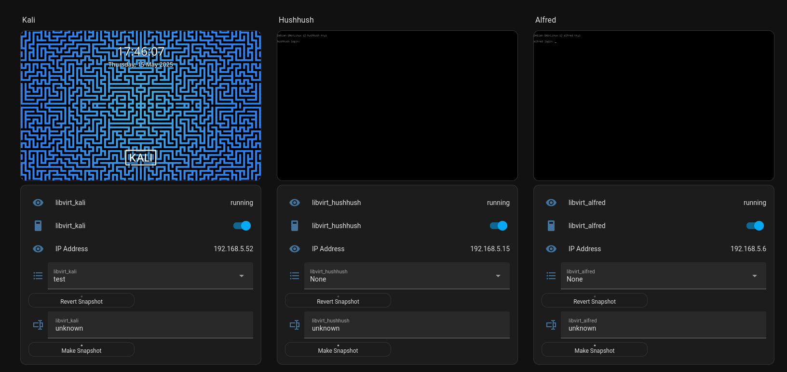

# Home Assistant Libvirt Integration

This is a custom integration for Home Assistant to monitor and control virtual machines using `virsh` over SSH.



## Features

- View domain info and state
- Control power (start, shutdown, suspend, resume)
- Take screenshots from VMs
- Snapshot support
- Secure communication via SSH

## Installation (via HACS)

1. Add this repository to HACS as a custom integration:
   - URL: `https://github.com/Bram-diederik/home-assistant-libvirt-integration`
2. Reboot Home Assistant.
3. Add the integration via YAML.

## SSH Key Setup

To allow Home Assistant to connect to your libvirt hosts:

create a ssh key with no password with ssh-keygen to /share/libvirt/key
ssh-copy-id this key

(you can protect commands with `command="/opt/ha_virt_protect.sh",no-agent-forwarding,no-user-rc,no-X11-forwarding,no-port-forwarding ssh-rsa AAAA... your-key-comment` using the script in opt)

## config setup

```
sensor:
  - platform: libvirt
    uri: qemu://system
    ssh_host: "user@linux_host"
    include_interfaces: true

switch:
  - platform: libvirt
    uri: "qemu://system"
    ssh_host: "user@linux_host"
```


## Dashboard example

```
type: entities
entities:
  - entity: sensor.libvirt_kali
  - entity: switch.libvirt_kali
  - type: attribute
    entity: sensor.libvirt_kali
    attribute: ip
    name: IP Address
  - entity: input_select.libvirt_kali
  - type: custom:button-card
    name: Revert Snapshot
    icon: mdi:backup-restore
    tap_action:
      action: call-service
      service: libvirt.revert_snapshot
      service_data:
        name: kali
        snapshot: "[[[ return states[\"input_select.libvirt_kali\"].state ]]]"
    styles:
      card:
        - padding: 4px 8px
        - font-size: 12px
        - height: 30px
        - width: 220px
  - entity: input_text.libvirt_kali
  - type: custom:button-card
    name: Make Snapshot
    icon: mdi:camera
    tap_action:
      action: call-service
      service: libvirt.create_snapshot
      service_data:
        name: kali
        snapshot: "[[[ return states[\"input_text.libvirt_kali\"].state ]]]"
    styles:
      card:
        - padding: 4px 8px
        - font-size: 12px
        - height: 30px
        - width: 220px
```

house keeping automation
```
alias: libvirt screenshots and snapshots
description: make libvirt screenshots and manage the snapshots.
triggers:
  - minutes: /3
    trigger: time_pattern
conditions: []
actions:
  - if:
      - condition: state
        entity_id: sensor.libvirt_alfred
        state: running
    then:
      - data:
          name: alfred
        action: libvirt.take_screenshot
      - action: input_select.set_options
        metadata: {}
        data:
          options: |-
            {{
              (state_attr('sensor.libvirt_alfred', 'snapshots') 
              | default([]) 
              | map(attribute='name') 
              | list)
              or ['None'] }}
        target:
          entity_id: input_select.libvirt_alfred
```
